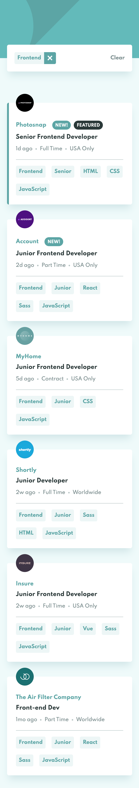
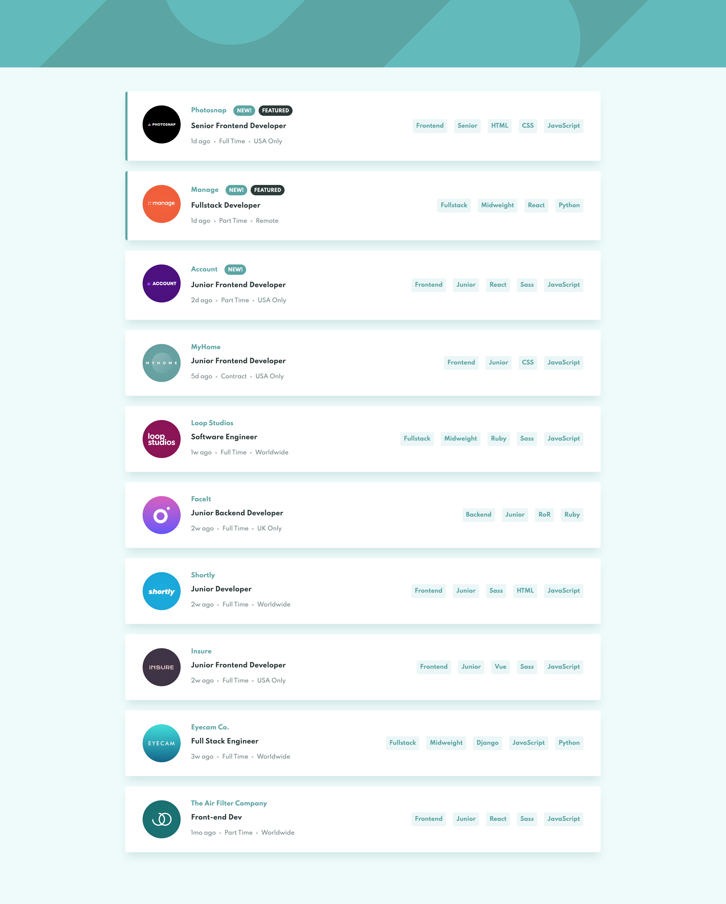

# Frontend Mentor - Job listings with filtering solution

This is a solution to the [Job listings with filtering challenge on Frontend Mentor]
## Table of contents

- [The challenge](#the-challenge)
- [Screenshot](#screenshot)
- [Links](#links)
- [Built with](#built-with)
- [Author](#author)
### The challenge

Users should be able to:

- View the optimal layout for the site depending on their device's screen size
- See hover states for all interactive elements on the page
- Filter job listings based on the categories

### Screenshot
[Mobile]()

[Desktop]()

### Links

- Solution URL: [Code](https://github.com/d1bolozan/jobs-website)
- Live Site URL: [Jobs-website](https://jobs-website-dusky.vercel.app/)

### Built with

- HTML/SCSS
- BEM
- Flexbox
- Mobile-first workflow
- [React](https://reactjs.org/) - JS library

## Author

- Github - [Dumitru Bolozan](https://github.com/d1bolozan)
